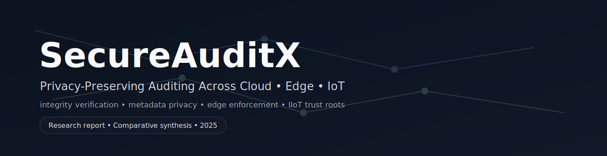

<p align="center">
  
</p>


### Privacy-Preserving Auditing Across Cloud • Edge • IoT

**Author:** Andrew Photinakis  
**Affiliation:** Rochester Institute of Technology (RIT)  

---

## 📌 Overview

**SecureAuditX** is a research-driven synthesis of **privacy-preserving data integrity auditing mechanisms** spanning **cloud storage systems, edge computing platforms, and IoT / Industrial IoT (IIoT) environments**.

As distributed systems become increasingly heterogeneous, traditional auditing mechanisms fail to scale due to:

- Metadata leakage (file identities, access patterns, timestamps)
- Dependence on full data access
- High computational and communication overhead
- Poor support for dynamic data updates
- Lack of physical security assumptions for edge and IIoT devices

SecureAuditX evaluates modern auditing frameworks and extracts **design principles for building scalable, privacy-first integrity verification pipelines** across the cloud–edge–IoT continuum.

---

## 🎯 Research Contributions

This repository contains the materials for the research report:

> **Integrated Privacy-Preserving Auditing: Synthesizing Cloud, Edge, and IoT Integrity Mechanisms**

Key contributions include:

- **Comparative analysis of five state-of-the-art auditing frameworks** across cloud, edge, and IIoT deployments
- **Unified evaluation criteria** covering:
  - Privacy guarantees (content + metadata)
  - Computational and communication efficiency
  - Scalability and trust assumptions
  - Dynamic data support (insert / update / delete)
- **Architectural synthesis** combining:
  - Time-based auditing
  - Identity-based cryptography
  - Homomorphic verification
  - Edge-enforced access control
  - Hardware roots of trust (PUFs, TEEs)
- **Regulatory alignment** with GDPR, CCPA, EU Cyber Resilience Act, and NIST Privacy Framework
- **Ethical analysis** grounded in the ACM Code of Ethics

Rather than proposing a single monolithic protocol, SecureAuditX argues for **layered, context-aware auditing architectures**.

---

## 🧠 Core Concepts Covered

- Privacy-Preserving Auditing (PDP, POR)
- Homomorphic Signatures & Aggregated Proofs
- Identity-Based Cryptography (IBC)
- Time-Based Auditing
- Dynamic Data Integrity Verification
- Edge Data Integrity Verification (EDIV)
- Attribute-Based Access Control (ABAC)
- Physical Unclonable Functions (PUFs)
- Trusted Execution Environments (TEEs)
- Metadata Privacy & Pseudonymity

---

## 🏗️ Surveyed Frameworks

The report synthesizes and evaluates five foundational approaches:

| Domain Focus | Key Techniques |
|-------------|----------------|
| Cloud Auditing | Time-based metadata-hiding verification |
| Dynamic IoT | Self-triggered homomorphic auditing |
| Cloud-to-Cloud Transfer | Constant-time identity-based auditing |
| IIoT Security | PUF + TEE hardware-assisted verification |
| Edge Enforcement | Integrity-driven access control (EDIV + ABAC) |

Each framework is evaluated along privacy scope, efficiency, scalability, dynamic support, and threat model assumptions.

---

## ⚖️ Legal & Ethical Considerations

### Legal Alignment
- **GDPR** — Data minimization, integrity, rectification
- **CCPA** — Accuracy and reasonable security guarantees
- **EU Cyber Resilience Act** — Security-by-design for IoT/IIoT
- **NIST Privacy Framework** — Govern & Protect functions

### Ethical Analysis
- Prevention of harm from integrity failures
- Metadata privacy as a first-class ethical concern
- Trade-offs between transparency and obfuscation
- Equity implications of hardware-based security models

---

## 🔮 Future Directions

Potential extensions of SecureAuditX include:

- Prototype implementations of hybrid auditing architectures
- Lightweight cryptographic primitives for dynamic IoT data
- Standardized abstractions for IIoT hardware security
- Decentralized auditing using blockchain-backed verifiers
- Empirical benchmarking across real-world edge deployments

---

## 📖 Citation

If you reference this work, please cite:

```bibtex
@techreport{photinakis2025SecureAuditX,
  title={Integrated Privacy-Preserving Auditing: Synthesizing Cloud, Edge, and IoT Integrity Mechanisms},
  author={Photinakis, Andrew},
  institution={Rochester Institute of Technology},
  year={2025}
}
````

---

## 📜 License

This work is released for **academic and research use**.
Please contact the author for reuse beyond citation or educational purposes.

---

## ✉️ Contact

**Andrew Photinakis**
📧 [acp7795@rit.edu](mailto:acp7795@rit.edu)
🎓 Rochester Institute of Technology
